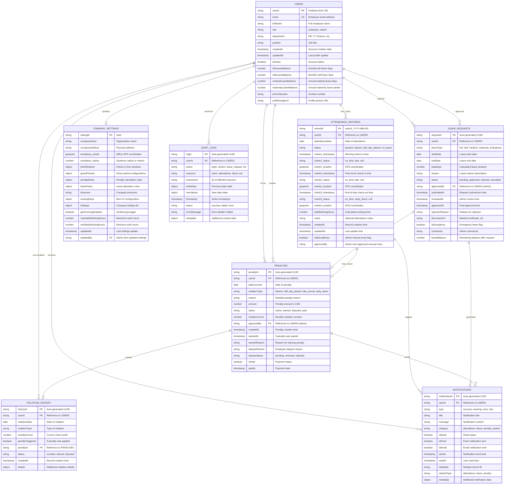
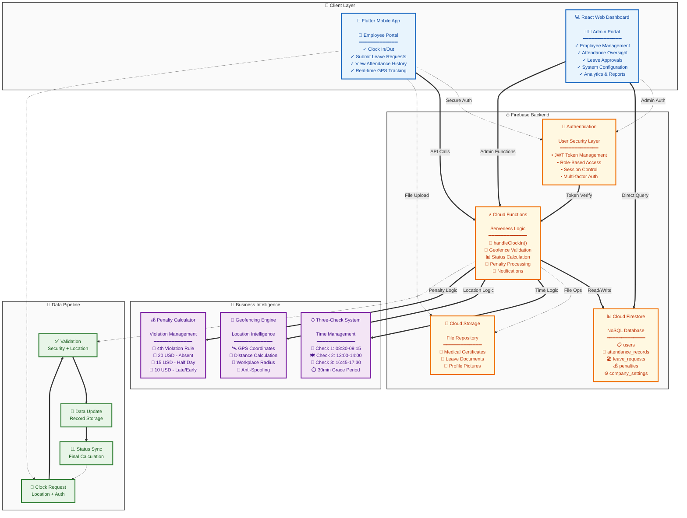

## 1. ERD

```mermaid
erDiagram
    USERS {
        string userId PK "Firebase Auth UID"
        string email UK "Employee email address"
        string fullName "Full employee name"
        string role "employee, admin"
        string department "HR, IT, Finance, etc"
        string position "Job title"
        timestamp createdAt "Account creation date"
        timestamp updatedAt "Last profile update"
        boolean isActive "Account status"
        number fullLeaveBalance "Monthly full leave days"
        number halfLeaveBalance "Monthly half leave days"
        number medicalLeaveBalance "Annual medical leave days"
        number maternityLeaveBalance "Annual maternity leave weeks"
        string phoneNumber "Contact number"
        string profileImageUrl "Profile picture URL"
    }

    ATTENDANCE_RECORDS {
        string recordId PK "userId_YYYY-MM-DD"
        string userId FK "Reference to USERS"
        date attendanceDate "Date of attendance"
        string status "present, absent, half_day_absent, on_leave"
        timestamp check1_timestamp "Morning check-in time"
        string check1_status "on_time, late, null"
        geopoint check1_location "GPS coordinates"
        timestamp check2_timestamp "Post-lunch check-in time"
        string check2_status "on_time, late, null"
        geopoint check2_location "GPS coordinates"
        timestamp check3_timestamp "End-of-day check-out time"
        string check3_status "on_time, early_leave, null"
        geopoint check3_location "GPS coordinates"
        number totalWorkingHours "Calculated working time"
        string notes "Optional attendance notes"
        timestamp createdAt "Record creation time"
        timestamp updatedAt "Last update time"
        boolean isManualEntry "Admin manual entry flag"
        string approvedBy "Admin who approved manual entry"
    }

    LEAVE_REQUESTS {
        string requestId PK "Auto-generated UUID"
        string userId FK "Reference to USERS"
        string leaveType "full, half, medical, maternity, emergency"
        date startDate "Leave start date"
        date endDate "Leave end date"
        number totalDays "Calculated leave duration"
        string reason "Leave reason description"
        string status "pending, approved, rejected, cancelled"
        string approvedBy FK "Reference to USERS (admin)"
        timestamp submittedAt "Request submission time"
        timestamp reviewedAt "Admin review time"
        timestamp approvedAt "Final approval time"
        string rejectionReason "Reason for rejection"
        string documentUrl "Medical certificate, etc"
        boolean isEmergency "Emergency leave flag"
        string comments "Admin comments"
        number leaveBalance "Remaining balance after request"
    }

    PENALTIES {
        string penaltyId PK "Auto-generated UUID"
        string userId FK "Reference to USERS"
        date dateIncurred "Date of penalty"
        string violationType "absent, half_day_absent, late_arrival, early_leave"
        string reason "Detailed penalty reason"
        number amount "Penalty amount in USD"
        string status "active, waived, disputed, paid"
        number violationCount "Monthly violation number"
        string approvedBy FK "Reference to USERS (admin)"
        timestamp createdAt "Penalty creation time"
        timestamp waivedAt "If penalty was waived"
        string waivedReason "Reason for waiving penalty"
        string disputeReason "Employee dispute reason"
        string disputeStatus "pending, resolved, rejected"
        boolean isPaid "Payment status"
        timestamp paidAt "Payment date"
    }

    COMPANY_SETTINGS {
        string settingId PK "main"
        string companyName "Organization name"
        string companyAddress "Physical address"
        geopoint workplace_center "Office GPS coordinates"
        number workplace_radius "Geofence radius in meters"
        object timeWindows "Check-in time windows"
        object gracePeriods "Grace period configurations"
        object penaltyRules "Penalty calculation rules"
        object leavePolicy "Leave allocation rules"
        string timezone "Company timezone"
        object workingDays "Mon-Fri configuration"
        object holidays "Company holiday list"
        boolean geoFencingEnabled "Geofencing toggle"
        number maxDailyWorkingHours "Maximum work hours"
        number minDailyWorkingHours "Minimum work hours"
        timestamp updatedAt "Last settings update"
        string updatedBy FK "Admin who updated settings"
    }

    NOTIFICATIONS {
        string notificationId PK "Auto-generated UUID"
        string userId FK "Reference to USERS"
        string type "success, warning, error, info"
        string title "Notification title"
        string message "Notification content"
        string category "attendance, leave, penalty, system"
        boolean isRead "Read status"
        boolean isPush "Push notification sent"
        boolean isEmail "Email notification sent"
        timestamp sentAt "Notification send time"
        timestamp readAt "User read time"
        string relatedId "Related record ID"
        string relatedType "attendance, leave, penalty"
        object metadata "Additional notification data"
    }

    AUDIT_LOGS {
        string logId PK "Auto-generated UUID"
        string userId FK "Reference to USERS"
        string action "login, clockin, leave_request, etc"
        string resource "users, attendance, leave, etc"
        string resourceId "ID of affected resource"
        object oldValues "Previous data state"
        object newValues "New data state"
        timestamp timestamp "Action timestamp"
        string status "success, failed, error"
        string errorMessage "Error details if failed"
        object metadata "Additional context data"
    }

    VIOLATION_HISTORY {
        string historyId PK "Auto-generated UUID"
        string userId FK "Reference to USERS"
        date violationDate "Date of violation"
        string violationType "Type of violation"
        number monthlyCount "Count in that month"
        boolean penaltyTriggered "If penalty was applied"
        string penaltyId FK "Reference to PENALTIES"
        string status "counted, waived, disputed"
        timestamp createdAt "Record creation time"
        object details "Additional violation details"
    }

    %% Relationships
    USERS ||--o{ ATTENDANCE_RECORDS : "has_many"
    USERS ||--o{ LEAVE_REQUESTS : "submits"
    USERS ||--o{ PENALTIES : "incurs"
    USERS ||--o{ NOTIFICATIONS : "receives"
    USERS ||--o{ AUDIT_LOGS : "performs"
    USERS ||--o{ VIOLATION_HISTORY : "accumulates"

    USERS ||--o{ LEAVE_REQUESTS : "approves"
    USERS ||--o{ PENALTIES : "creates"
    USERS ||--o| COMPANY_SETTINGS : "updates"

    LEAVE_REQUESTS ||--o| PENALTIES : "may_trigger"
    ATTENDANCE_RECORDS ||--o| PENALTIES : "may_cause"
    PENALTIES ||--o| VIOLATION_HISTORY : "creates"

    ATTENDANCE_RECORDS ||--o{ NOTIFICATIONS : "triggers"
    LEAVE_REQUESTS ||--o{ NOTIFICATIONS : "generates"
    PENALTIES ||--o{ NOTIFICATIONS : "sends"
```

---

## 2. Architecture

```mermaid
graph TB
    subgraph CLIENT ["🎯 Client Layer"]
        direction TB
        A["📱 Flutter Mobile App<br/><br/>👤 Employee Portal<br/>━━━━━━━━━━━━━<br/>✓ Clock In/Out<br/>✓ Submit Leave Requests<br/>✓ View Attendance History<br/>✓ Real-time GPS Tracking"]
        B["💻 React Web Dashboard<br/><br/>👨‍💼 Admin Portal<br/>━━━━━━━━━━━━━<br/>✓ Employee Management<br/>✓ Attendance Oversight<br/>✓ Leave Approvals<br/>✓ System Configuration<br/>✓ Analytics & Reports"]
    end

    subgraph FIREBASE ["🔥 Firebase Backend"]
        direction TB
        C["🔐 Authentication<br/><br/>User Security Layer<br/>━━━━━━━━━━━━━<br/>• JWT Token Management<br/>• Role-Based Access<br/>• Session Control<br/>• Multi-factor Auth"]

        D["📊 Cloud Firestore<br/><br/>NoSQL Database<br/>━━━━━━━━━━━━━<br/>📋 users<br/>📅 attendance_records<br/>🏖️ leave_requests<br/>💰 penalties<br/>⚙️ company_settings"]

        E["⚡ Cloud Functions<br/><br/>Serverless Logic<br/>━━━━━━━━━━━━━<br/>🎯 handleClockIn()<br/>📍 Geofence Validation<br/>📊 Status Calculation<br/>💸 Penalty Processing<br/>📧 Notifications"]

        F["📁 Cloud Storage<br/><br/>File Repository<br/>━━━━━━━━━━━━━<br/>🏥 Medical Certificates<br/>📄 Leave Documents<br/>📸 Profile Pictures"]
    end

    subgraph LOGIC ["🧠 Business Intelligence"]
        direction TB
        G["⏰ Three-Check System<br/><br/>Time Management<br/>━━━━━━━━━━━━━<br/>🌅 Check 1: 08:30-09:15<br/>🍽️ Check 2: 13:00-14:00<br/>🌇 Check 3: 16:45-17:30<br/>⏱️ 30min Grace Period"]

        H["📍 Geofencing Engine<br/><br/>Location Intelligence<br/>━━━━━━━━━━━━━<br/>🛰️ GPS Coordinates<br/>📏 Distance Calculation<br/>🎯 Workplace Radius<br/>🚫 Anti-Spoofing"]

        I["💰 Penalty Calculator<br/><br/>Violation Management<br/>━━━━━━━━━━━━━<br/>🔴 4th Violation Rule<br/>💸 20 USD - Absent<br/>💸 15 USD - Half Day<br/>💸 10 USD - Late/Early"]
    end

    subgraph FLOW ["🔄 Data Pipeline"]
        direction LR
        J["📲 Clock Request<br/>Location + Auth"]
        K["✅ Validation<br/>Security + Location"]
        L["💾 Data Update<br/>Record Storage"]
        M["📊 Status Sync<br/>Final Calculation"]
    end

    A -.->|Secure Auth| C
    A ==>|API Calls| E
    A -.->|File Upload| F

    B -.->|Admin Auth| C
    B ==>|Direct Query| D
    B ==>|Admin Functions| E

    C ==>|Token Verify| E
    E ==>|Read/Write| D
    E -.->|File Ops| F

    E ==>|Time Logic| G
    E ==>|Location Logic| H
    E ==>|Penalty Logic| I

    J ==> K
    K ==> L
    L ==> M
    M -.-> J

    A -.-> J
    E -.-> K

    classDef clientStyle fill:#e8f4fd,stroke:#1565c0,stroke-width:3px,color:#0d47a1
    classDef firebaseStyle fill:#fff8e1,stroke:#ef6c00,stroke-width:3px,color:#bf360c
    classDef logicStyle fill:#f3e5f5,stroke:#7b1fa2,stroke-width:3px,color:#4a148c
    classDef flowStyle fill:#e8f5e8,stroke:#2e7d32,stroke-width:3px,color:#1b5e20
    classDef subgraphStyle fill:#fafafa,stroke:#424242,stroke-width:2px

    class A,B clientStyle
    class C,D,E,F firebaseStyle
    class G,H,I logicStyle
    class J,K,L,M flowStyle
    class CLIENT,FIREBASE,LOGIC,FLOW subgraphStyle
```

---

## 3. Sequence

```mermaid
sequenceDiagram
    participant E as 📱 Employee<br/>Flutter App
    participant A as 🔐 Firebase<br/>Authentication
    participant F as ⚡ Cloud<br/>Functions
    participant D as 🗄️ Firestore<br/>Database
    participant G as 🗺️ Geofencing<br/>Engine
    participant T as ⏰ Time<br/>Validator
    participant P as 💰 Penalty<br/>Calculator
    participant N as 🔔 Notification<br/>Service

    Note over E,N: 🌅 MORNING CHECK-IN WORKFLOW

    E->>+A: 🚀 Initiate Login Request
    A-->>-E: ✅ Authentication Token

    E->>E: 📍 Capture GPS Location
    E->>+F: 🎯 handleClockIn(location, token, timestamp)

    Note over F: 🔍 SECURITY VALIDATION PHASE
    F->>+A: 🎫 Validate Auth Token
    A-->>-F: ✅ Token Valid + User Info

    Note over F: 📊 DATA RETRIEVAL PHASE
    F->>+D: 📋 Fetch User Profile
    D-->>-F: 👤 User Details + Role

    F->>+D: ⚙️ Get Company Settings
    D-->>-F: 🏢 Geofence Config + Time Windows

    F->>+D: 📅 Get Today's Attendance Record
    D-->>-F: 📊 Current Check Status

    Note over F: ⏰ TIME WINDOW VALIDATION
    F->>+T: 🕐 Validate Current Time Window
    T->>T: 🎯 Check Against:<br/>Morning: 08:30-09:15<br/>Lunch: 13:00-14:00<br/>Evening: 16:45-17:30
    T-->>-F: ✅ Window Valid (Check 1 - On Time)

    Note over F: 📍 GEOFENCE VALIDATION
    F->>+G: 🗺️ Validate Location
    G->>G: 📐 Calculate Distance<br/>from Workplace Center
    G->>G: 🎯 Check Against Radius<br/>(e.g., 100 meters)
    G-->>-F: ✅ Location Valid (Within Geofence)

    Note over F: 💾 ATTENDANCE RECORD UPDATE
    F->>+D: 📝 Update Attendance Record
    Note over D: 🔄 Set check1_timestamp<br/>🔄 Set check1_status: "on_time"<br/>🔄 Update daily_status
    D-->>-F: ✅ Record Updated Successfully

    Note over F: 📊 STATUS CALCULATION
    F->>F: 🧮 Count Completed Checks<br/>(1 of 3 completed)
    F->>F: 📊 Calculate Daily Status<br/>(In Progress)

    F-->>-E: 🎉 SUCCESS: Check-1 Completed!<br/>Status: On Time

    Note over E: 🔔 USER FEEDBACK
    E->>E: 📱 Display Success Message<br/>🎯 Update UI Status<br/>📊 Refresh Dashboard

    Note over E,N: 🍽️ LUNCH RETURN CHECK-IN

    E->>+F: 🎯 handleClockIn(location, token, timestamp)
    F->>+T: 🕐 Validate Time Window
    T-->>-F: ⚠️ Late Check (13:45 - 15min late)
    F->>+G: 🗺️ Validate Location
    G-->>-F: ✅ Location Valid
    F->>+D: 📝 Update Record
    Note over D: 🔄 Set check2_timestamp<br/>🔄 Set check2_status: "late"
    D-->>-F: ✅ Updated
    F-->>-E: ⚠️ SUCCESS: Check-2 Late<br/>Warning: Late arrival noted

    Note over E,N: 🌇 END OF DAY CHECK-OUT

    E->>+F: 🎯 handleClockIn(location, token, timestamp)
    F->>+T: 🕐 Validate Time Window
    T-->>-F: ✅ On Time (17:00)
    F->>+G: 🗺️ Validate Location
    G-->>-F: ✅ Location Valid
    F->>+D: 📝 Update Final Record
    Note over D: 🔄 Set check3_timestamp<br/>🔄 Set check3_status: "on_time"<br/>🔄 Set daily_status: "present"
    D-->>-F: ✅ Day Complete

    Note over F: 💰 PENALTY ASSESSMENT
    F->>+P: 📊 Assess Monthly Violations
    P->>+D: 📈 Count Month Violations
    D-->>-P: 📊 Violation Count: 3
    P->>P: 🎯 Check Penalty Rule<br/>(4th violation triggers penalty)
    P-->>-F: ✅ No Penalty (Under threshold)

    F-->>-E: 🎉 DAY COMPLETED!<br/>Status: Present<br/>All checks successful

    Note over E,N: 🔔 NOTIFICATION WORKFLOW
    F->>+N: 📧 Trigger Success Notification
    N->>E: 🔔 Push: "Daily attendance complete!"
    N->>+D: 📋 Log Notification
    D-->>-N: ✅ Logged
    N-->>-F: 📧 Notification Sent

    Note over E,N: ❌ ERROR SCENARIO EXAMPLE

    rect rgb(255, 245, 245)
        Note over E,N: 🚨 GEOFENCE VIOLATION SCENARIO
        E->>+F: 🎯 handleClockIn(remote_location, token)
        F->>+G: 🗺️ Validate Location
        G->>G: 📐 Distance: 2.5km from office<br/>🚫 Outside 100m radius
        G-->>-F: ❌ GEOFENCE VIOLATION
        F-->>-E: 🚫 FAILED: Outside workplace area<br/>Distance: 2.5km from office
        E->>E: 📱 Show Error Message<br/>🗺️ Display Map with location
    end

    rect rgb(255, 248, 245)
        Note over E,N: ⏰ TIME WINDOW VIOLATION
        E->>+F: 🎯 handleClockIn(location, token, 10:00)
        F->>+T: 🕐 Validate Time (10:00 AM)
        T->>T: ❌ All windows closed<br/>Morning: 08:30-09:15 (MISSED)<br/>Grace: 09:15-09:45 (EXPIRED)
        T-->>-F: ❌ NO VALID TIME WINDOW
        F-->>-E: 🚫 FAILED: No active check window<br/>Next window: 13:00-14:00
    end

    Note over E,N: 📊 END OF DAY ANALYTICS UPDATE
    F->>+D: 📈 Update Daily Analytics
    F->>+D: 📊 Update Monthly Stats
    D-->>-F: ✅ Analytics Updated
```

---

## 4. UML

```mermaid
classDiagram
    %% 1. Define all Class Blocks
    class User {
        +String userId
        +String email
        +String fullName
        +String role
        +String department
        +String position
        +Boolean isActive
        +Number fullLeaveBalance
        +Number halfLeaveBalance
        +Number medicalLeaveBalance
        +Number maternityLeaveBalance
        +String phoneNumber
        +String profileImageUrl
        +DateTime createdAt
        +DateTime updatedAt
        +login()
        +logout()
        +updateProfile()
        +requestLeave()
        +viewAttendanceHistory()
    }

    class AttendanceRecord {
        +String recordId
        +String userId
        +Date attendanceDate
        +String status
        +DateTime check1_timestamp
        +String check1_status
        +GeoPoint check1_location
        +DateTime check2_timestamp
        +String check2_status
        +GeoPoint check2_location
        +DateTime check3_timestamp
        +String check3_status
        +GeoPoint check3_location
        +Number totalWorkingHours
        +String notes
        +Boolean isManualEntry
        +String approvedBy
        +calculateDailyStatus()
        +validateTimeWindow()
        +checkGeofence()
    }

    class LeaveRequest {
        +String requestId
        +String userId
        +String leaveType
        +Date startDate
        +Date endDate
        +Number totalDays
        +String reason
        +String status
        +String approvedBy
        +String documentUrl
        +DateTime createdAt
        +DateTime updatedAt
        +approve()
        +reject()
        +calculateLeaveDays()
        +validateLeaveBalance()
    }

    class Penalty {
        +String penaltyId
        +String userId
        +Date dateIncurred
        +String violationType
        +Number amount
        +String status
        +String approvedBy
        +DateTime createdAt
        +waive()
        +activate()
        +calculateAmount()
    }

    class ViolationHistory {
        +String historyId
        +String userId
        +Date violationDate
        +String violationType
        +Number monthlyCount
        +Boolean penaltyTriggered
        +String penaltyId
        +DateTime createdAt
        +incrementCount()
        +checkPenaltyThreshold()
    }

    class CompanySettings {
        +String companyName
        +GeoPoint workplace_center
        +Number workplace_radius
        +Object timeWindows
        +Object gracePeriods
        +Object penaltyRules
        +Object leavePolicy
        +String timezone
        +Array workingDays
        +Array holidays
        +DateTime updatedAt
        +updateGeofence()
        +updateTimeWindows()
        +updatePenaltyRules()
        +validateSettings()
    }

    class Notification {
        +String notificationId
        +String userId
        +String title
        +String message
        +String category
        +Boolean isRead
        +String relatedId
        +DateTime createdAt
        +markAsRead()
        +send()
    }

    class AuditLog {
        +String logId
        +String userId
        +String action
        +String resource
        +String resourceId
        +Object oldValues
        +Object newValues
        +DateTime timestamp
        +String status
        +createLog()
        +queryLogs()
    }

    class AuthenticationService {
        +login(email, password)
        +logout()
        +register(userData)
        +validateToken(token)
        +refreshToken()
        +resetPassword(email)
        +verifyEmail(token)
    }

    class GeofencingService {
        +validateLocation(userLocation, workplaceCenter, radius)
        +calculateDistance(point1, point2)
        +isWithinGeofence(location)
        +getLocationAccuracy()
        +detectLocationSpoofing()
    }

    class TimeValidationService {
        +validateTimeWindow(timestamp, timeWindows)
        +calculateStatus(timestamp, window)
        +isWithinGracePeriod(timestamp, gracePeriod)
        +getCurrentTimeWindow()
        +getNextTimeWindow()
    }

    class PenaltyCalculationService {
        +calculateMonthlyPenalties(userId, month)
        +assessViolation(violationType, violationCount)
        +applyPenaltyRules(violations, rules)
        +generatePenaltyReport(userId)
        +waivePenalty(penaltyId, reason)
    }

    class NotificationService {
        +sendPushNotification(userId, message)
        +sendEmailNotification(email, subject, body)
        +createNotification(userId, notification)
        +markAsRead(notificationId)
        +getUnreadCount(userId)
    }

    class CloudFunctions {
        +handleClockIn(location, token, timestamp)
        +handleLeaveApproval(requestId, action)
        +calculateMonthlyPenalties()
        +sendDailyReminders()
        +generateMonthlyReports()
        +auditUserAction(action, resource)
    }

    class FlutterMobileApp {
        +clockIn()
        +clockOut()
        +submitLeaveRequest()
        +viewAttendanceHistory()
        +uploadDocument()
        +receiveNotifications()
        +updateLocation()
    }

    class ReactWebDashboard {
        +manageEmployees()
        +viewAttendanceReports()
        +approveLeaveRequests()
        +configureSettings()
        +generateAnalytics()
        +manageGeofence()
        +exportData()
    }

    %% 2. Define all Relationships
    User "1" -- "0..*" AttendanceRecord : has
    User "1" -- "0..*" LeaveRequest : submits
    User "1" -- "0..*" Penalty : incurs
    User "1" -- "0..*" ViolationHistory : accumulates
    User "1" -- "0..*" Notification : receives
    User "1" -- "0..*" AuditLog : generates

    AttendanceRecord "1" -- "0..*" ViolationHistory : creates
    ViolationHistory "1" -- "0..1" Penalty : triggers
    LeaveRequest "1" -- "0..1" AuditLog : logs

    CompanySettings -- GeofencingService : configures
    CompanySettings -- TimeValidationService : defines
    CompanySettings -- PenaltyCalculationService : rules

    CloudFunctions ..> AuthenticationService : uses
    CloudFunctions ..> GeofencingService : validates
    CloudFunctions ..> TimeValidationService : checks
    CloudFunctions ..> PenaltyCalculationService : calculates
    CloudFunctions ..> NotificationService : sends

    FlutterMobileApp ..> CloudFunctions : calls
    ReactWebDashboard ..> CloudFunctions : calls
    FlutterMobileApp ..> AuthenticationService : authenticates
    ReactWebDashboard ..> AuthenticationService : authenticates
```

---
