### **Technical Specification: Geofencing Logic & Implementation**

**Version:** 1.0
**Date:** 02 July 2025
**Author:** Project Developer

#### **1. Introduction & Purpose**

This document provides a detailed specification for the geofencing functionality within the Automated Attendance Management System. The primary purpose of the geofencing feature is to ensure that employees are physically present at a designated workplace when they perform a clock-in or clock-out action.

This document outlines the architectural approach, the client-side and server-side implementation details, the core validation logic, and the security considerations necessary to build a robust and reliable system.

The foundational principle of this implementation is **server-authoritative validation**. The mobile client is treated as an untrusted source of information, and the final decision on the validity of a location is made exclusively on a secure backend.

#### **2. Core Concepts & Architectural Approach**

**2.1. What is Geofencing?**
A geofence is a virtual perimeter for a real-world geographic area. In this project, the geofence is defined by two key parameters stored in the `COMPANY_SETTINGS` collection:

1.  `workplace_center` (GeoPoint): The precise latitude and longitude of the center of the workplace.
2.  `workplace_radius` (Number): The radius in meters from the center, defining the boundary of the virtual perimeter.

An employee is considered "within the geofence" if their current GPS coordinates fall within this defined circle.

**2.2. Architectural Model: Client-Initiated, Server-Validated**

The system employs a "Client-Initiated, Server-Validated" model. This is distinct from a background geofencing model where the OS might notify the app of entry/exit events. Our model is chosen specifically because attendance is an **explicit user action**.

The workflow is as follows:

```mermaid
graph TD
    A["📱 Client: User presses 'Clock In'"]
    A --> B{"📍 Client: Get GPS Coordinates"}
    B --> C["☁️ Client: Call Secure Cloud Function with Coordinates"]
    C --> D{"⚡ Server: Cloud Function Triggered"}
    D --> E["⚙️ Server: Fetch Geofence Rules from Firestore"]
    E --> F{"🛰️ Server: Calculate Distance"}
    F --> G{"⚖️ Server: Compare Distance vs. Radius"}
    subgraph "Decision Logic"
        G --> H["✅ Valid: Update Attendance Record"]
        G --> I["❌ Invalid: Log Attempt & Prepare Error"]
    end
    H --> J["✔️ Server: Respond with Success"]
    I --> K["🔥 Server: Respond with Error"]
    J --> L["📱 Client: Display Success UI"]
    K --> M["📱 Client: Display Error UI with Reason"]

```



**2.3. The Golden Rule: Never Trust the Client**
All client-side data, including GPS coordinates, can potentially be manipulated (e.g., via "GPS spoofing" apps). Therefore, the client application's sole responsibility is to capture the location and report it. It performs **zero** validation logic. The Cloud Function is the single source of truth for all validation.

#### **3. Implementation Details**

**3.1. Client-Side Implementation (Flutter App)**

The Flutter app's role is simple and focused.

1.  **User Action:** The user initiates the process by tapping a button (e.g., `ElevatedButton`).
2.  **Get GPS Coordinates:** The application uses the `geolocator` package to get the device's current location. This is the most critical client-side step.

    ```dart
    import 'package:geolocator/geolocator.dart';

    Future<Position> _determinePosition() async {
      // ... (Code to handle permissions)
      return await Geolocator.getCurrentPosition();
    }
    ```

3.  **Call the Cloud Function:** Using the `cloud_functions` package, the app calls the `handleClockIn` HTTPS Callable Function, passing the captured coordinates. The entire operation is wrapped in a `try/catch` block to handle network errors or errors returned from the function.

    ```dart
    import 'package:cloud_functions/cloud_functions.dart';

    Future<void> clockIn() async {
        try {
            Position position = await _determinePosition();
            final HttpsCallable callable = FirebaseFunctions.instance.httpsCallable('handleClockIn');
            final result = await callable.call(<String, dynamic>{
                'latitude': position.latitude,
                'longitude': position.longitude,
            });
            // Handle success UI from result.data
        } on FirebaseFunctionsException catch (e) {
            // Handle specific error codes from the function (e.g., e.code == 'failed-precondition')
        } catch (e) {
            // Handle generic errors
        }
    }
    ```

4.  **Handle Response:** The app updates its UI based on the success or failure message returned by the Cloud Function. It does not need to know _why_ it failed, only that it did, and can display the error message provided by the server.

**3.2. Server-Side Implementation (Firebase Cloud Function)**

This is where the core logic resides. The `handleClockIn` function is written in TypeScript.

1.  **Function Trigger and Authentication:** The function is an `onCall` trigger, which automatically handles user authentication. The `context.auth.uid` provides the secure, verified user ID.

2.  **Data Retrieval:** The function first fetches the necessary configuration from Firestore.

    ```typescript
    const settingsDoc = await db
      .collection("COMPANY_SETTINGS")
      .doc("main")
      .get();
    const geofenceConfig = settingsDoc.data();
    const workplaceCenter = {
      latitude: geofenceConfig.workplace_center.latitude,
      longitude: geofenceConfig.workplace_center.longitude,
    };
    const workplaceRadius = geofenceConfig.workplace_radius;
    ```

3.  **The Core Calculation (Distance Validation):** The function uses a robust library like `geolib` to perform the Haversine distance calculation. This is a highly accurate method for determining the distance between two points on a sphere.

    ```typescript
    import { getDistance } from "geolib";

    const userLocation = {
      latitude: data.latitude,
      longitude: data.longitude,
    };

    const distanceInMeters = getDistance(userLocation, workplaceCenter);

    if (distanceInMeters > workplaceRadius) {
      throw new functions.https.HttpsError(
        "failed-precondition",
        `You are ${Math.round(
          distanceInMeters
        )} meters away from the work area. Clock-in rejected.`
      );
    }
    ```

4.  **Integration with Business Logic:** The geofence validation does not happen in isolation. It is one step in a chain of validations performed by the function:

    - **Step A:** Validate Time Window (Is the user checking in at an allowed time?).
    - **Step B:** **Validate Geofence (Is the user physically present?).**
    - **Step C:** Update the database record.

5.  **Responding to the Client:** The function returns a structured JSON object.
    - **On Success:** `return { success: true, message: "Clock-in successful!" };`
    - **On Failure:** The `throw new functions.https.HttpsError(...)` call automatically sends a correctly formatted error response to the client, which can be caught and handled.

#### **4. Security & Anti-Spoofing Considerations**

**4.1. GPS Spoofing Vulnerability**
It is impossible to completely prevent GPS spoofing on the software level, as determined users can use rooted (Android) or jailbroken (iOS) devices with specialized software to provide a fake location to the operating system.

**4.2. Mitigation Strategies**
While not foolproof, several layers of mitigation can be implemented to deter casual spoofing.

1.  **Mock Location Detection (Android):** The Flutter `geolocator` package provides a property, `position.isMocked`. The client app can read this flag.

    - **Implementation:** The client can pass `isMocked: true` to the Cloud Function. The function can then be configured to automatically reject any clock-in attempts where this flag is true. This is a strong deterrent.

2.  **Server-Side Analysis (Advanced):** For a more advanced system, one could log location history and look for anomalies, such as:

    - **Impossible Travel:** Clocking in from two drastically different locations in an impossibly short amount of time.
    - **IP Address Mismatch:** Comparing the IP address geolocation of the request with the reported GPS coordinates. (Note: IP geolocation is very inaccurate and should only be used as a weak signal).

3.  **The Primary Defense: Policy and Transparency**
    The most effective defense is organizational policy. The system's purpose is to provide data.
    - The Terms of Service should explicitly state that attempting to falsify location is a breach of company policy.
    - The system should log all relevant data (`checkN_location`, `isMocked` flag, IP address) in the `AUDIT_LOGS` or `ATTENDANCE_RECORDS`. If a dispute arises, an administrator can review this data to identify suspicious patterns.

#### **5. Conclusion**

The geofencing implementation for this project is designed with a **security-first, server-authoritative mindset**. By centralizing all validation logic within a Firebase Cloud Function and treating the client as a simple data collector, the system is protected against client-side tampering. While advanced threats like GPS spoofing exist, the combination of technical deterrents (mock location detection) and clear organizational policies provides a robust and reliable solution suitable for its intended purpose.
