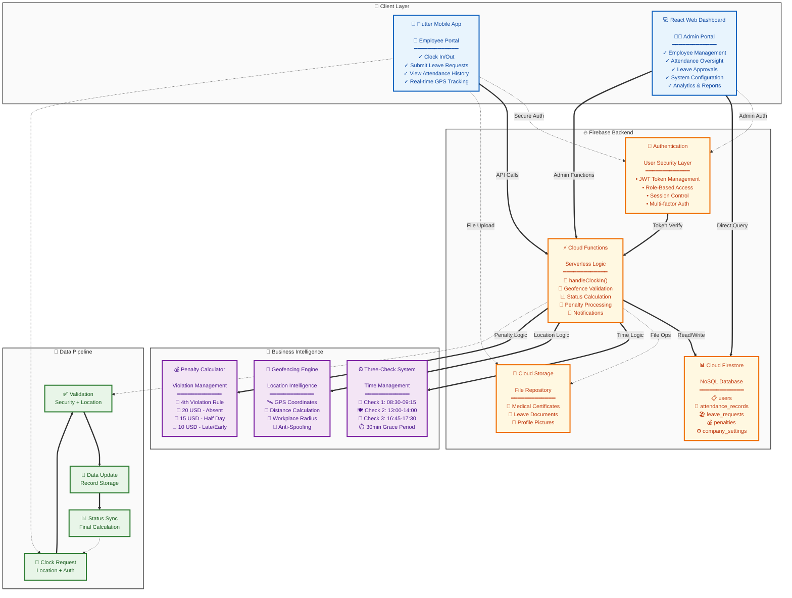

### **Technical Documentation: Automated Attendance Management System**

**Version:** 2
**Date:** 02 July 2025

#### **1. Introduction**

This document provides a detailed technical overview of the Automated Attendance Management System. It is intended for software developers and system administrators who will build, maintain, or extend the system.

The project is designed to solve the inefficiencies of manual attendance tracking by providing a secure, scalable, and low-cost digital solution. The system comprises three main components:

1.  **A Flutter Mobile Application:** For employees to perform clock-ins, submit leave requests, and view their attendance history.
2.  **A React Web Dashboard:** For administrators to manage employees, oversee attendance records, approve leaves, and configure system settings.
3.  **A Firebase Backend:** A serverless platform providing authentication, database, and business logic execution.

This document details the system's architecture, the technology stack, core logic, database schema, security measures, and deployment procedures.

#### **2. System Architecture**

The system is built on a modern client-server architecture, with Firebase acting as the serverless backend-as-a-service (BaaS). The architecture is designed to be data-driven, with core business rules (e.g., time windows, penalty rules) being configurable in the database rather than hardcoded in the application logic.

**2.1. High-Level Architecture Diagram**

The following diagram illustrates the primary components and their interactions. Clients (Mobile App, Web Dashboard) communicate securely with Firebase services, which handle all business logic and data persistence.

**2.2. Workflow Sequence Diagram: Clock-In Process**

This diagram details the sequence of events for a single, successful clock-in attempt by an employee. The critical takeaway is that the Flutter App never decides if a clock-in is valid; it only reports its location to the Cloud Function, which acts as the secure validator.

```mermaid
sequenceDiagram
    participant E as 📱 Employee<br/>Flutter App
    participant A as 🔐 Firebase<br/>Authentication
    participant F as ⚡ Cloud<br/>Functions
    participant D as 🗄️ Firestore<br/>Database
    participant G as 🗺️ Geofencing<br/>Engine
    participant T as ⏰ Time<br/>Validator
    participant P as 💰 Penalty<br/>Calculator
    participant N as 🔔 Notification<br/>Service

    Note over E,N: 🌅 MORNING CHECK-IN WORKFLOW

    E->>+A: 🚀 Initiate Login Request
    A-->>-E: ✅ Authentication Token

    E->>E: 📍 Capture GPS Location
    E->>+F: 🎯 handleClockIn(location, token, timestamp)

    Note over F: 🔍 SECURITY VALIDATION PHASE
    F->>+A: 🎫 Validate Auth Token
    A-->>-F: ✅ Token Valid + User Info

    Note over F: 📊 DATA RETRIEVAL PHASE
    F->>+D: 📋 Fetch User Profile
    D-->>-F: 👤 User Details + Role

    F->>+D: ⚙️ Get Company Settings
    D-->>-F: 🏢 Geofence Config + Time Windows

    F->>+D: 📅 Get Today's Attendance Record
    D-->>-F: 📊 Current Check Status

    Note over F: ⏰ TIME WINDOW VALIDATION
    F->>+T: 🕐 Validate Current Time Window
    T->>T: 🎯 Check Against:<br/>Morning: 08:30-09:15<br/>Lunch: 13:00-14:00<br/>Evening: 16:45-17:30
    T-->>-F: ✅ Window Valid (Check 1 - On Time)

    Note over F: 📍 GEOFENCE VALIDATION
    F->>+G: 🗺️ Validate Location
    G->>G: 📐 Calculate Distance<br/>from Workplace Center
    G->>G: 🎯 Check Against Radius<br/>(e.g., 100 meters)
    G-->>-F: ✅ Location Valid (Within Geofence)

    Note over F: 💾 ATTENDANCE RECORD UPDATE
    F->>+D: 📝 Update Attendance Record
    Note over D: 🔄 Set check1_timestamp<br/>🔄 Set check1_status: "on_time"<br/>🔄 Update daily_status
    D-->>-F: ✅ Record Updated Successfully

    Note over F: 📊 STATUS CALCULATION
    F->>F: 🧮 Count Completed Checks<br/>(1 of 3 completed)
    F->>F: 📊 Calculate Daily Status<br/>(In Progress)

    F-->>-E: 🎉 SUCCESS: Check-1 Completed!<br/>Status: On Time

    Note over E: 🔔 USER FEEDBACK
    E->>E: 📱 Display Success Message<br/>🎯 Update UI Status<br/>📊 Refresh Dashboard

    Note over E,N: 🍽️ LUNCH RETURN CHECK-IN

    E->>+F: 🎯 handleClockIn(location, token, timestamp)
    F->>+T: 🕐 Validate Time Window
    T-->>-F: ⚠️ Late Check (13:45 - 15min late)
    F->>+G: 🗺️ Validate Location
    G-->>-F: ✅ Location Valid
    F->>+D: 📝 Update Record
    Note over D: 🔄 Set check2_timestamp<br/>🔄 Set check2_status: "late"
    D-->>-F: ✅ Updated
    F-->>-E: ⚠️ SUCCESS: Check-2 Late<br/>Warning: Late arrival noted

    Note over E,N: 🌇 END OF DAY CHECK-OUT

    E->>+F: 🎯 handleClockIn(location, token, timestamp)
    F->>+T: 🕐 Validate Time Window
    T-->>-F: ✅ On Time (17:00)
    F->>+G: 🗺️ Validate Location
    G-->>-F: ✅ Location Valid
    F->>+D: 📝 Update Final Record
    Note over D: 🔄 Set check3_timestamp<br/>🔄 Set check3_status: "on_time"<br/>🔄 Set daily_status: "present"
    D-->>-F: ✅ Day Complete

    Note over F: 💰 PENALTY ASSESSMENT
    F->>+P: 📊 Assess Monthly Violations
    P->>+D: 📈 Count Month Violations
    D-->>-P: 📊 Violation Count: 3
    P->>P: 🎯 Check Penalty Rule<br/>(4th violation triggers penalty)
    P-->>-F: ✅ No Penalty (Under threshold)

    F-->>-E: 🎉 DAY COMPLETED!<br/>Status: Present<br/>All checks successful

    Note over E,N: 🔔 NOTIFICATION WORKFLOW
    F->>+N: 📧 Trigger Success Notification
    N->>E: 🔔 Push: "Daily attendance complete!"
    N->>+D: 📋 Log Notification
    D-->>-N: ✅ Logged
    N-->>-F: 📧 Notification Sent

    Note over E,N: ❌ ERROR SCENARIO EXAMPLE

    rect rgb(255, 245, 245)
        Note over E,N: 🚨 GEOFENCE VIOLATION SCENARIO
        E->>+F: 🎯 handleClockIn(remote_location, token)
        F->>+G: 🗺️ Validate Location
        G->>G: 📐 Distance: 2.5km from office<br/>🚫 Outside 100m radius
        G-->>-F: ❌ GEOFENCE VIOLATION
        F-->>-E: 🚫 FAILED: Outside workplace area<br/>Distance: 2.5km from office
        E->>E: 📱 Show Error Message<br/>🗺️ Display Map with location
    end

    rect rgb(255, 248, 245)
        Note over E,N: ⏰ TIME WINDOW VIOLATION
        E->>+F: 🎯 handleClockIn(location, token, 10:00)
        F->>+T: 🕐 Validate Time (10:00 AM)
        T->>T: ❌ All windows closed<br/>Morning: 08:30-09:15 (MISSED)<br/>Grace: 09:15-09:45 (EXPIRED)
        T-->>-F: ❌ NO VALID TIME WINDOW
        F-->>-E: 🚫 FAILED: No active check window<br/>Next window: 13:00-14:00
    end

    Note over E,N: 📊 END OF DAY ANALYTICS UPDATE
    F->>+D: 📈 Update Daily Analytics
    F->>+D: 📊 Update Monthly Stats
    D-->>-F: ✅ Analytics Updated
```

#### **3. Technology Stack & Libraries**

The project utilizes a specific set of modern technologies chosen for their efficiency, scalability, and suitability for a solo developer.

**3.1. Backend**

- **Firebase:** The core serverless backend.
  - **Cloud Firestore:** A NoSQL, document-based database for all application data.
  - **Firebase Authentication:** Handles secure user registration, login, and session management.
  - **Cloud Functions for Firebase:** Executes all secure, server-side business logic written in TypeScript.
  - ✅ `setUserRole`: Callable function that promotes/demotes users by attaching Firebase Auth custom claims and syncing `USERS`.
  - ✅ `seedFirestore.ts`: CLI seeding utility (`npm run seed:firestore`) that reads `.env` credentials, grants the initial admin claim, and populates `USERS` and `COMPANY_SETTINGS` defaults.
  - **Cloud Storage:** Used for storing files, such as medical certificates uploaded for leave requests.
- **Node.js:** The runtime environment for executing Cloud Functions.
- **TypeScript:** Provides static typing for robust and maintainable Cloud Functions code.
- **Input Validation:** All configuration inputs (e.g., company settings) are validated server-side before being persisted to Firestore, ensuring data integrity and safeguarding automated workflows.
- **Clock-In Callable:** The `handleClockIn` callable Cloud Function now orchestrates geofence, time-window, and attendance updates in a single server-authoritative flow, emitting audit logs and user notifications for every successful check-in.

**3.2. Mobile App (Flutter)**

- **Dart:** The programming language for Flutter.
- **Framework Packages:**
  - `firebase_core`, `firebase_auth`, `cloud_firestore`, `cloud_functions`: The FlutterFire suite for connecting to Firebase.
  - `geolocator`: To get the device's current GPS coordinates.
  - `table_calendar`: For creating a highly customizable calendar view for attendance and leave history.
  - `dynamic_color`: To implement Material 3's dynamic theming based on the user's wallpaper (Android).
  - `intl`: For robust date and time formatting.

**3.3. Admin Dashboard (React)**

- **Next.js:** A React framework providing Server-Side Rendering (SSR) and a powerful development experience.
- **TypeScript:** Ensures type safety across the entire web application.
- **Tailwind CSS:** A utility-first CSS framework for rapid UI development.
- **Firebase (Web SDK v9):** For connecting the React app to Firebase services.
- **Component Libraries & UI:**
  - **Shadcn/ui:** A collection of beautifully designed, accessible, and customizable components used for `Card`, `Table`, `Dialog`, `Badge`, and `Calendar`.
  - **React-Leaflet:** A library for creating interactive map views to allow the admin to set the workplace geofence.

#### **4. Detailed Geofencing & Core Logic Implementation**

**4.1. The Role of Firebase Cloud Functions**
All critical business logic is executed within Firebase Cloud Functions to ensure security and data integrity. Key callable and scheduled services include:
- `handleClockIn`: Validates geofence proximity, time windows, and attendance rules before committing updates to `ATTENDANCE_RECORDS` and logging outcomes.
- Administrative callables: `setUserRole`, `createEmployee`, `updateEmployee`, `toggleUserStatus`, `manualSetAttendance`, `handleLeaveApproval`, `updateCompanySettings`, `waivePenalty`, `calculateMonthlyViolations`, `generateAttendanceReport`, `getDashboardStats`, `sendNotification`, and `sendBulkNotification`.
- Automations: Daily reminder jobs, scheduled notifications, monthly penalty calculations, and analytics synchronisation triggered via Cloud Scheduler, consuming data from `COMPANY_SETTINGS`, `ATTENDANCE_RECORDS`, `LEAVE_REQUESTS`, `PENALTIES`, `VIOLATION_HISTORY`, and `AUDIT_LOGS`.

**4.2. Core Logic: The Configurable Three-Check Attendance System**
The system's logic is highly flexible, driven by rules stored in the `COMPANY_SETTINGS` collection in Firestore. This allows administrators to adjust business rules without requiring a code deployment.

- **Time Windows & Grace Periods:** The `handleClockIn` function dynamically fetches the `timeWindows` and `gracePeriods` objects from `COMPANY_SETTINGS` before validating the timestamp of a check-in request.
- **Attendance Status Logic:** The final status for the day is calculated based on the number of valid checks recorded:
  - **Present:** All **three** checks are successfully completed.
  - **Half-Day Absent:** Exactly **two** checks are completed.
  - **Absent:** **One or zero** checks are completed.
- **Late Arrival & Early Leave Logic:** The definitions for late/early checks are configured in the `gracePeriods` object in settings. A check outside the configured grace period is considered a missed check and is not recorded.

**4.3. Penalty & Leave System**

- **Violation Tracking:** Negative attendance outcomes (`late`, `early_leave`, `absent`, `half_day_absent`) create or update entries in `VIOLATION_HISTORY`, preserving a detailed history of infractions.
- **Penalty Incurrence:** A scheduled Cloud Function evaluates accumulated violations, applies `penaltyRules` defined in `COMPANY_SETTINGS`, and emits `PENALTIES` documents when thresholds are reached.
- **Leave Logic:** `handleLeaveApproval` validates requests, adjusts user leave balances, updates request metadata, and backfills `ATTENDANCE_RECORDS` with `on_leave` status for approved ranges while logging the action.
- **Admin Penalty Console:** The `/penalties` dashboard now streams live data from the `PENALTIES` collection with client-side filtering by status, employee, and incurred date range. Admins can invoke the `waivePenalty` callable by submitting an audited justification, updating Firestore and recording a corresponding audit log entry.

- **Notification Orchestration:** The `/notifications` dashboard lists all rows from `NOTIFICATIONS`, highlighting read status, audience, and delivery metadata. Admins can send single-user or bulk announcements through the `sendNotification` / `sendBulkNotification` callables with built-in form validation, ensuring messages match the established categories and severity types before enqueuing.

- **Audit Trail Visibility:** A dedicated `/audit-logs` viewer lists entries from `AUDIT_LOGS`, including client-side filters for action, resource, executor, and date range. Selecting a log exposes structured diffs of `oldValues`, `newValues`, and any supplemental metadata/error payloads, supporting compliance and incident investigations.

#### **5. Database Schema (Firestore Data Model)**

The database is structured into several collections to normalize data and ensure scalability. Below is a detailed description of each collection based on the project's ERD.

- **`USERS`**: Stores all user-related information.

  - `