### **Technical Documentation: Automated Attendance Management System**

**Version:** 2
**Date:** 02 July 2025

#### **1. Introduction**

This document provides a detailed technical overview of the Automated Attendance Management System. It is intended for software developers and system administrators who will build, maintain, or extend the system.

The project is designed to solve the inefficiencies of manual attendance tracking by providing a secure, scalable, and low-cost digital solution. The system comprises three main components:

1.  **A Flutter Mobile Application:** For employees to perform clock-ins, submit leave requests, and view their attendance history.
2.  **A React Web Dashboard:** For administrators to manage employees, oversee attendance records, approve leaves, and configure system settings.
3.  **A Firebase Backend:** A serverless platform providing authentication, database, and business logic execution.

This document details the system's architecture, the technology stack, core logic, database schema, security measures, and deployment procedures.

#### **2. System Architecture**

The system is built on a modern client-server architecture, with Firebase acting as the serverless backend-as-a-service (BaaS). The architecture is designed to be data-driven, with core business rules (e.g., time windows, penalty rules) being configurable in the database rather than hardcoded in the application logic.

**2.1. High-Level Architecture Diagram**

The following diagram illustrates the primary components and their interactions. Clients (Mobile App, Web Dashboard) communicate securely with Firebase services, which handle all business logic and data persistence.

```mermaid
graph TB
    subgraph CLIENT ["🎯 Client Layer"]
        direction TB
        A["📱 Flutter Mobile App<br/><br/>👤 Employee Portal<br/>━━━━━━━━━━━━━<br/>✓ Clock In/Out<br/>✓ Submit Leave Requests<br/>✓ View Attendance History<br/>✓ Real-time GPS Tracking"]
        B["💻 React Web Dashboard<br/><br/>👨‍💼 Admin Portal<br/>━━━━━━━━━━━━━<br/>✓ Employee Management<br/>✓ Attendance Oversight<br/>✓ Leave Approvals<br/>✓ System Configuration<br/>✓ Analytics & Reports"]
    end

    subgraph FIREBASE ["🔥 Firebase Backend"]
        direction TB
        C["🔐 Authentication<br/><br/>User Security Layer<br/>━━━━━━━━━━━━━<br/>• JWT Token Management<br/>• Role-Based Access<br/>• Session Control<br/>• Multi-factor Auth"]

        D["📊 Cloud Firestore<br/><br/>NoSQL Database<br/>━━━━━━━━━━━━━<br/>📋 users<br/>📅 attendance_records<br/>🏖️ leave_requests<br/>💰 penalties<br/>⚙️ company_settings"]

        E["⚡ Cloud Functions<br/><br/>Serverless Logic<br/>━━━━━━━━━━━━━<br/>🎯 handleClockIn()<br/>📍 Geofence Validation<br/>📊 Status Calculation<br/>💸 Penalty Processing<br/>📧 Notifications"]

        F["📁 Cloud Storage<br/><br/>File Repository<br/>━━━━━━━━━━━━━<br/>🏥 Medical Certificates<br/>📄 Leave Documents<br/>📸 Profile Pictures"]
    end

    subgraph LOGIC ["🧠 Business Intelligence"]
        direction TB
        G["⏰ Three-Check System<br/><br/>Time Management<br/>━━━━━━━━━━━━━<br/>🌅 Check 1: 08:30-09:15<br/>🍽️ Check 2: 13:00-14:00<br/>🌇 Check 3: 16:45-17:30<br/>⏱️ 30min Grace Period"]

        H["📍 Geofencing Engine<br/><br/>Location Intelligence<br/>━━━━━━━━━━━━━<br/>🛰️ GPS Coordinates<br/>📏 Distance Calculation<br/>🎯 Workplace Radius<br/>🚫 Anti-Spoofing"]

        I["💰 Penalty Calculator<br/><br/>Violation Management<br/>━━━━━━━━━━━━━<br/>🔴 4th Violation Rule<br/>💸 20 USD - Absent<br/>💸 15 USD - Half Day<br/>💸 10 USD - Late/Early"]
    end

    subgraph FLOW ["🔄 Data Pipeline"]
        direction LR
        J["📲 Clock Request<br/>Location + Auth"]
        K["✅ Validation<br/>Security + Location"]
        L["💾 Data Update<br/>Record Storage"]
        M["📊 Status Sync<br/>Final Calculation"]
    end

    A -.->|Secure Auth| C
    A ==>|API Calls| E
    A -.->|File Upload| F

    B -.->|Admin Auth| C
    B ==>|Direct Query| D
    B ==>|Admin Functions| E

    C ==>|Token Verify| E
    E ==>|Read/Write| D
    E -.->|File Ops| F

    E ==>|Time Logic| G
    E ==>|Location Logic| H
    E ==>|Penalty Logic| I

    J ==> K
    K ==> L
    L ==> M
    M -.-> J

    A -.-> J
    E -.-> K

    classDef clientStyle fill:#e8f4fd,stroke:#1565c0,stroke-width:3px,color:#0d47a1
    classDef firebaseStyle fill:#fff8e1,stroke:#ef6c00,stroke-width:3px,color:#bf360c
    classDef logicStyle fill:#f3e5f5,stroke:#7b1fa2,stroke-width:3px,color:#4a148c
    classDef flowStyle fill:#e8f5e8,stroke:#2e7d32,stroke-width:3px,color:#1b5e20
    classDef subgraphStyle fill:#fafafa,stroke:#424242,stroke-width:2px

    class A,B clientStyle
    class C,D,E,F firebaseStyle
    class G,H,I logicStyle
    class J,K,L,M flowStyle
    class CLIENT,FIREBASE,LOGIC,FLOW subgraphStyle
```

**2.2. Workflow Sequence Diagram: Clock-In Process**

This diagram details the sequence of events for a single, successful clock-in attempt by an employee. The critical takeaway is that the Flutter App never decides if a clock-in is valid; it only reports its location to the Cloud Function, which acts as the secure validator.

```mermaid
sequenceDiagram
    participant E as 📱 Employee<br/>Flutter App
    participant A as 🔐 Firebase<br/>Authentication
    participant F as ⚡ Cloud<br/>Functions
    participant D as 🗄️ Firestore<br/>Database
    participant G as 🗺️ Geofencing<br/>Engine
    participant T as ⏰ Time<br/>Validator
    participant P as 💰 Penalty<br/>Calculator
    participant N as 🔔 Notification<br/>Service

    Note over E,N: 🌅 MORNING CHECK-IN WORKFLOW

    E->>+A: 🚀 Initiate Login Request
    A-->>-E: ✅ Authentication Token

    E->>E: 📍 Capture GPS Location
    E->>+F: 🎯 handleClockIn(location, token, timestamp)

    Note over F: 🔍 SECURITY VALIDATION PHASE
    F->>+A: 🎫 Validate Auth Token
    A-->>-F: ✅ Token Valid + User Info

    Note over F: 📊 DATA RETRIEVAL PHASE
    F->>+D: 📋 Fetch User Profile
    D-->>-F: 👤 User Details + Role

    F->>+D: ⚙️ Get Company Settings
    D-->>-F: 🏢 Geofence Config + Time Windows

    F->>+D: 📅 Get Today's Attendance Record
    D-->>-F: 📊 Current Check Status

    Note over F: ⏰ TIME WINDOW VALIDATION
    F->>+T: 🕐 Validate Current Time Window
    T->>T: 🎯 Check Against:<br/>Morning: 08:30-09:15<br/>Lunch: 13:00-14:00<br/>Evening: 16:45-17:30
    T-->>-F: ✅ Window Valid (Check 1 - On Time)

    Note over F: 📍 GEOFENCE VALIDATION
    F->>+G: 🗺️ Validate Location
    G->>G: 📐 Calculate Distance<br/>from Workplace Center
    G->>G: 🎯 Check Against Radius<br/>(e.g., 100 meters)
    G-->>-F: ✅ Location Valid (Within Geofence)

    Note over F: 💾 ATTENDANCE RECORD UPDATE
    F->>+D: 📝 Update Attendance Record
    Note over D: 🔄 Set check1_timestamp<br/>🔄 Set check1_status: "on_time"<br/>🔄 Update daily_status
    D-->>-F: ✅ Record Updated Successfully

    Note over F: 📊 STATUS CALCULATION
    F->>F: 🧮 Count Completed Checks<br/>(1 of 3 completed)
    F->>F: 📊 Calculate Daily Status<br/>(In Progress)

    F-->>-E: 🎉 SUCCESS: Check-1 Completed!<br/>Status: On Time

    Note over E: 🔔 USER FEEDBACK
    E->>E: 📱 Display Success Message<br/>🎯 Update UI Status<br/>📊 Refresh Dashboard

    Note over E,N: 🍽️ LUNCH RETURN CHECK-IN

    E->>+F: 🎯 handleClockIn(location, token, timestamp)
    F->>+T: 🕐 Validate Time Window
    T-->>-F: ⚠️ Late Check (13:45 - 15min late)
    F->>+G: 🗺️ Validate Location
    G-->>-F: ✅ Location Valid
    F->>+D: 📝 Update Record
    Note over D: 🔄 Set check2_timestamp<br/>🔄 Set check2_status: "late"
    D-->>-F: ✅ Updated
    F-->>-E: ⚠️ SUCCESS: Check-2 Late<br/>Warning: Late arrival noted

    Note over E,N: 🌇 END OF DAY CHECK-OUT

    E->>+F: 🎯 handleClockIn(location, token, timestamp)
    F->>+T: 🕐 Validate Time Window
    T-->>-F: ✅ On Time (17:00)
    F->>+G: 🗺️ Validate Location
    G-->>-F: ✅ Location Valid
    F->>+D: 📝 Update Final Record
    Note over D: 🔄 Set check3_timestamp<br/>🔄 Set check3_status: "on_time"<br/>🔄 Set daily_status: "present"
    D-->>-F: ✅ Day Complete

    Note over F: 💰 PENALTY ASSESSMENT
    F->>+P: 📊 Assess Monthly Violations
    P->>+D: 📈 Count Month Violations
    D-->>-P: 📊 Violation Count: 3
    P->>P: 🎯 Check Penalty Rule<br/>(4th violation triggers penalty)
    P-->>-F: ✅ No Penalty (Under threshold)

    F-->>-E: 🎉 DAY COMPLETED!<br/>Status: Present<br/>All checks successful

    Note over E,N: 🔔 NOTIFICATION WORKFLOW
    F->>+N: 📧 Trigger Success Notification
    N->>E: 🔔 Push: "Daily attendance complete!"
    N->>+D: 📋 Log Notification
    D-->>-N: ✅ Logged
    N-->>-F: 📧 Notification Sent

    Note over E,N: ❌ ERROR SCENARIO EXAMPLE

    rect rgb(255, 245, 245)
        Note over E,N: 🚨 GEOFENCE VIOLATION SCENARIO
        E->>+F: 🎯 handleClockIn(remote_location, token)
        F->>+G: 🗺️ Validate Location
        G->>G: 📐 Distance: 2.5km from office<br/>🚫 Outside 100m radius
        G-->>-F: ❌ GEOFENCE VIOLATION
        F-->>-E: 🚫 FAILED: Outside workplace area<br/>Distance: 2.5km from office
        E->>E: 📱 Show Error Message<br/>🗺️ Display Map with location
    end

    rect rgb(255, 248, 245)
        Note over E,N: ⏰ TIME WINDOW VIOLATION
        E->>+F: 🎯 handleClockIn(location, token, 10:00)
        F->>+T: 🕐 Validate Time (10:00 AM)
        T->>T: ❌ All windows closed<br/>Morning: 08:30-09:15 (MISSED)<br/>Grace: 09:15-09:45 (EXPIRED)
        T-->>-F: ❌ NO VALID TIME WINDOW
        F-->>-E: 🚫 FAILED: No active check window<br/>Next window: 13:00-14:00
    end

    Note over E,N: 📊 END OF DAY ANALYTICS UPDATE
    F->>+D: 📈 Update Daily Analytics
    F->>+D: 📊 Update Monthly Stats
    D-->>-F: ✅ Analytics Updated
```

#### **3. Technology Stack & Libraries**

The project utilizes a specific set of modern technologies chosen for their efficiency, scalability, and suitability for a solo developer.

**3.1. Backend**

- **Firebase:** The core serverless backend.
  - **Cloud Firestore:** A NoSQL, document-based database for all application data.
  - **Firebase Authentication:** Handles secure user registration, login, and session management.
  - **Cloud Functions for Firebase:** Executes all secure, server-side business logic written in TypeScript.
  - ✅ `setUserRole`: Callable function that promotes/demotes users by attaching Firebase Auth custom claims and syncing `USERS`.
  - ✅ `seedFirestore.ts`: CLI seeding utility (`npm run seed:firestore`) that reads `.env` credentials, grants the initial admin claim, and populates `USERS` and `COMPANY_SETTINGS` defaults.
  - **Cloud Storage:** Used for storing files, such as medical certificates uploaded for leave requests.
- **Node.js:** The runtime environment for executing Cloud Functions.
- **TypeScript:** Provides static typing for robust and maintainable Cloud Functions code.
- **date-fns / date-fns-tz:** Provide reliable time arithmetic and timezone conversions for attendance validation.
- **Input Validation:** All configuration inputs (e.g., company settings) are validated server-side before being persisted to Firestore, ensuring data integrity and safeguarding automated workflows.
- **Clock-In Callable:** The `handleClockIn` callable Cloud Function now orchestrates geofence, time-window, and attendance updates in a single server-authoritative flow, emitting audit logs and user notifications for every successful check-in.

**3.2. Mobile App (Flutter)**

- **Dart:** The programming language for Flutter.
- **Framework Packages:**
  - `firebase_core`, `firebase_auth`, `cloud_firestore`, `cloud_functions`: The FlutterFire suite for connecting to Firebase.
  - `geolocator`: To get the device's current GPS coordinates.
  - `table_calendar`: For creating a highly customizable calendar view for attendance and leave history.
  - `dynamic_color`: To implement Material 3's dynamic theming based on the user's wallpaper (Android).
  - `intl`: For robust date and time formatting.
- **Phase 4 Foundation:**
  - **Structure:** Adopted a feature-first layout under `lib/features/<feature>` with cross-cutting support in `lib/core` (auth, config, navigation, providers, services) to keep UI, controllers, and infrastructure cohesive per feature.
  - **State Management:** Lightweight `ChangeNotifier` controllers exposed via `provider`. A global `SessionController` wraps Firebase Auth, hydrates custom claims, and persists session tokens via `flutter_secure_storage`; feature controllers follow the same pattern.
  - **Routing:** Central `AppRouter` powered by `go_router`, enforcing guarded navigation based on hydrated session state (`role === 'employee'`). Routes live in `lib/core/navigation` and hook into feature presentation widgets.
  - **Environment Handling:** `AppEnvironment` parses compile-time `--dart-define` values (`APP_FLAVOR`, `API_BASE_URL`, `SENTRY_DSN`) so dev/staging/prod builds stay configurable without hard-coded secrets.
  - **Bootstrap Pipeline:** `main.dart` initialises Firebase, registers background messaging handlers, loads provider graph via `configureAppProviders`, and displays a splash screen until initialization finishes.
  - **Services Layer:** `core/services` hosts typed adapters around callable Cloud Functions (attendance, leaves, notifications, onboarding/device tokens) so the mobile client stays thin and server-authoritative.

- **Phase 4.2 – Authentication & Onboarding Enhancements:**
  - **Login & Session:** `LoginController` coordinates Firebase Auth sign-in, performs claim checks (enforcing `role === 'employee'`), and surfaces friendly error messaging. `SessionController` tracks onboarding completion across launches via `SharedPreferences`.
  - **Onboarding Workflow:** `OnboardingController` handles location and notification permissions, registers device tokens through the `registerDeviceToken` callable, and records completion locally. `OnboardingScreen` guides the employee through these steps with status chips and contextual copy.
  - **Navigation Guard:** Authenticated users who have not finished onboarding are routed to `/onboarding` before reaching the home dashboard.

- **Phase 4.3 – Employee Dashboard & Clock-In:**
  - **Dashboard Data:** `DashboardRepository` aggregates `getEmployeeDashboard` and `getCompanySettingsPublic`, normalising attendance, remaining checks, leave balances, upcoming leave, penalties, unread notifications, and geofence window data.
  - **Home UI:** `DashboardView` renders the rich summary (attendance chips, leave balances, upcoming leave, penalties, company settings) and reacts to refreshes and clock-in outcomes.
  - **Clock-In Flow:** `ClockInController` coordinates permission validation, geolocation retrieval, and `handleClockIn` invocation. Success or failure is surfaced in the UI with snackbars and banner feedback, and successful clock-ins automatically refresh the dashboard.

**3.3. Admin Dashboard (React)**

- **Next.js:** A React framework providing Server-Side Rendering (SSR) and a powerful development experience.
- **TypeScript:** Ensures type safety across the entire web application.
- **Tailwind CSS:** A utility-first CSS framework for rapid UI development.
- **Firebase (Web SDK v9):** For connecting the React app to Firebase services.
- **Component Libraries & UI:**
  - **Shadcn/ui:** A collection of beautifully designed, accessible, and customizable components used for `Card`, `Table`, `Dialog`, `Badge`, and `Calendar`.
  - **React-Leaflet:** A library for creating interactive map views to allow the admin to set the workplace geofence.

#### **4. Detailed Geofencing & Core Logic Implementation**

**4.1. The Role of Firebase Cloud Functions**
All critical business logic is executed within Firebase Cloud Functions to ensure security and data integrity. Key callable and scheduled services include:
- `handleClockIn`: Validates geofence proximity, time windows, and attendance rules before committing updates to `ATTENDANCE_RECORDS` and logging outcomes.
- Administrative callables: `setUserRole`, `createEmployee`, `updateEmployee`, `toggleUserStatus`, `manualSetAttendance`, `handleLeaveApproval`, `updateCompanySettings`, `waivePenalty`, `calculateMonthlyViolations`, `generateAttendanceReport`, `getDashboardStats`, `sendNotification`, and `sendBulkNotification`.
- Automations: Daily reminder jobs, scheduled notifications, monthly penalty calculations, and analytics synchronisation triggered via Cloud Scheduler, consuming data from `COMPANY_SETTINGS`, `ATTENDANCE_RECORDS`, `LEAVE_REQUESTS`, `PENALTIES`, `VIOLATION_HISTORY`, and `AUDIT_LOGS`.

**4.2. Core Logic: The Configurable Three-Check Attendance System**
The system's logic is highly flexible, driven by rules stored in the `COMPANY_SETTINGS` collection in Firestore. This allows administrators to adjust business rules without requiring a code deployment.

- **Time Windows & Grace Periods:** The `handleClockIn` function dynamically fetches the `timeWindows` and `gracePeriods` objects from `COMPANY_SETTINGS` before validating the timestamp of a check-in request. Grace periods are configured **per check slot** (check1, check2, check3) for granular control.
- **Attendance Status Logic:** The final status for the day is calculated based on the number of valid checks recorded:
  - **Present:** All **three** checks are successfully completed.
  - **Half-Day Absent:** Exactly **two** checks are completed.
  - **Absent:** **One or zero** checks are completed.
- **Violation Types:** The system tracks four distinct violation types:
  - **Late Arrival:** Check-in within grace period **after** time window end (applies to check1 and check2)
  - **Early Leave:** Check-out within grace period **before** time window start (applies to check3 only)
  - **Absent:** Daily status when 0-1 checks are completed
  - **Half-Day Absent:** Daily status when exactly 2 checks are completed

**4.3. Penalty & Leave System**

- **Violation Tracking:** The system tracks four distinct violation types from attendance records:
  - **Daily Status Violations:** `absent` and `half_day_absent` from the `status` field
  - **Check-Level Violations:** `late` from check1/check2 status, `early_leave` from check3 status
  - All violations are recorded in `VIOLATION_HISTORY` with detailed field and status information
- **Penalty Incurrence:** A scheduled Cloud Function (`scheduledPenaltyAutomation`) runs monthly on the 1st at 2am UTC:
  - Counts violations by type for each employee within the month
  - Applies configurable `violationThresholds` per violation type (default: 4th violation triggers penalty)
  - Creates `PENALTIES` documents with type-specific amounts:
    - Absent: $20
    - Half-Day Absent: $15
    - Late: $10
    - Early Leave: $10
  - Configuration via `COMPANY_SETTINGS.penaltyRules.violationThresholds` and `amounts`
- **Leave Logic:**
  - **Submission:** `submitLeaveRequest` calculates `totalDays` (inclusive of start/end dates) and validates against user's current leave balance for the specified type
  - **Validation:** Rejects requests if `totalDays > currentBalance` with clear error messaging
  - **Approval:** `handleLeaveApproval` deducts `totalDays` from appropriate balance field, backfills `ATTENDANCE_RECORDS` with `on_leave` status, and logs all actions
  - **Cancellation:** `cancelLeaveRequest` restores leave balance for approved leaves and removes attendance backfills
- **Admin Penalty Console:** The `/penalties` dashboard streams live data from `PENALTIES` with filtering by status, employee, and date. Admins invoke `waivePenalty` with audited justifications.

- **Leave Attachment Workflow:** Employees request a signed upload URL via `generateLeaveAttachmentUploadUrl`, PUT the document directly to Cloud Storage, and then finalize it with `registerLeaveAttachment`. Metadata (size, MIME type, owner) is validated server-side before the attachment can be linked to a leave request. The workflow enforces company-level limits (`allowedLeaveAttachmentTypes`, `maxLeaveAttachmentSizeMb`, and `leaveAttachmentRequiredTypes`) so that medical and maternity leaves require supporting documents while other leave types remain optional. Attachments transition through `pending → ready → attached` states in the `LEAVE_ATTACHMENTS` collection, enabling audit trails and cleanup of unused uploads.
  - Backend access is exposed through two employee-callable Cloud Functions: `generateLeaveAttachmentUploadUrl` (returns a v4 signed URL plus metadata) and `registerLeaveAttachment` (verifies the uploaded object, marks it `ready`, and captures final metadata). `submitLeaveRequest` now only accepts `attachmentId` values referencing `LEAVE_ATTACHMENTS`, guaranteeing attachments are vetted before association.
- **Notification Orchestration:** The `/notifications` dashboard now streams live data from the `NOTIFICATIONS` collection with client-side filtering by status, employee, and incurred date range. Admins can send single-user or bulk announcements through the `sendNotification` / `sendBulkNotification` callables with built-in form validation, ensuring messages match the established categories and severity types before enqueuing.
  - Employee APIs: Mobile clients consume `listEmployeeNotifications` with cursor/limit filters, acknowledge items via `markNotificationRead`, and surface penalty history through `listEmployeePenalties`. Device registrations use `registerDeviceToken`, deduplicating tokens across devices while tracking metadata and platform for push notification routing.
- **Audit Trail Visibility:** A dedicated `/audit-logs` viewer lists entries from `AUDIT_LOGS`, including client-side filters for action, resource, executor, and date range. Selecting a log exposes structured diffs of `oldValues`, `newValues`, and any supplemental metadata/error payloads, supporting compliance and incident investigations.

**4.4. Employee Notifications & Penalties (Phase 4.6 Completion)**

- **Mobile Notifications Center:** The Flutter client now bundles `NotificationRepository`, `NotificationController`, and a dedicated `NotificationsScreen` that surfaces segmented filters (all/unread/read), infinite scrolling, optimistic mark-as-read behaviour, and rich detail sheets for each record. Errors roll back local optimistic updates to maintain consistency.
- **Penalty Management:** `PenaltyRepository` and `PenaltyController` consume the new `acknowledgePenalty` callable alongside `listEmployeePenalties`, delivering a penalties list with filters, acknowledgement workflow, and detail sheet metadata surfaced to end users.
- **Push Deep Links:** A centralised `PushNotificationService` wires Firebase Messaging background and cold-start handling, translating payload metadata into `AppRouter` navigation (defaulting to `/notifications`, routing to `/penalties` for penalty payloads, or honouring explicit `route` overrides).
- **Dashboard Hooks:** The home dashboard exposes quick access to the notifications inbox (with unread counts) and incorporates penalty summaries, keeping employees aware of outstanding actions.
